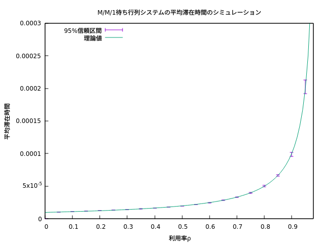
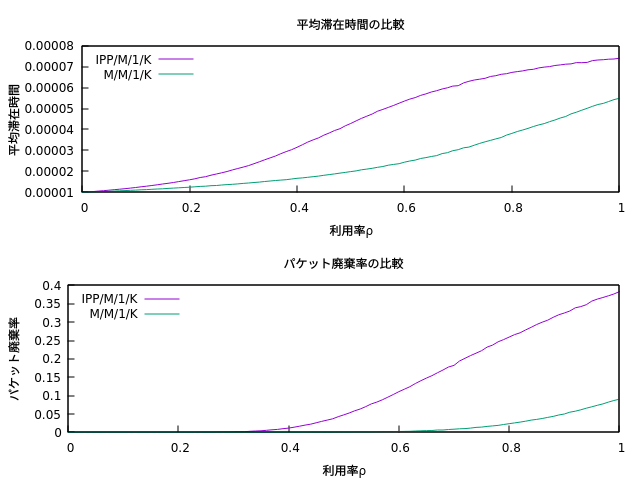
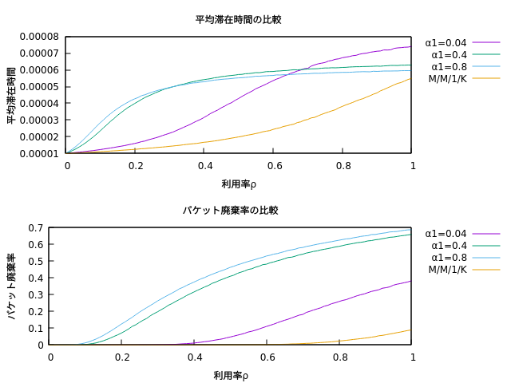
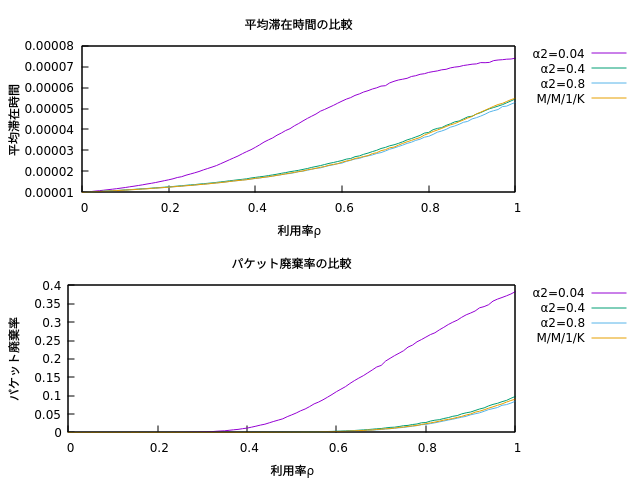

# kyutech-netdesign
2021年ネットワークデザイン特論の最終課題

## M/M/1 待ち行列システムのシミュレーション
M/M/1 待ち行列システムの平均滞在時間  および,
真の平均滞在時間　 の **95\%信頼区間** を求める
シミュレーションプログラムを作成する.

- シミュレーション方式: Single-run 法
- 標本区間長: 100,000(パケット), 標本個数n: 10
- サービス率

(※ 回線帯域: 1Gb/s, 平均パケット長: 1,250バイト → 平均処理時間 と仮定)

以上の条件のもと, , 95\%信頼区間と利用率
の関係を図示する.
その際, 待ち行列理論から解析的に求まる値(式(38))と比較, 考察する.

  

## IPP/M/1/K 待ち行列システムのシミュレーション
パケットの到着に関する確率仮定がパラメータ()
の **IPP(Interrupted Poisson Process)** に従う場合を考える. この過程の概要は以下の通りである.

- ある時点において, 到着に関してON, OFFのどちらかの状態をとる.
  - ON状態の場合, パケットの到着はパラメータのポアソン過程に従う.
  - OFF状態の場合, パケット到着はないものとする.
- ある時点の状態変化は ON(OFF) にある場合, パラメータでOFF(ON)に遷移する.
  - 平均ON(OFF)区間は, となる.
 
本システムにおいて以下を実現する.

(a) 平均滞在時間/パケット廃棄率を導出するシミュレーションプログラムの作成

(b) M/M/1/K システムとの性能比較について, **各自適当に課題を設定してデータ取得, 考察**. なおポアソン過程のパラメータ
 と, IPPの平均トラヒック量
は等しくする. すなわち,

  

### 利用率を変化させたときの平均滞在時間, パケット廃棄率の比較

  

### α1をパラメータとしたときの利用率変化時の比較

  

### α2をパラメータとしたときの利用率変化時の比較

  

### IPP/M/1/K のKをパラメータとしたときの利用率変化時の比較

  

